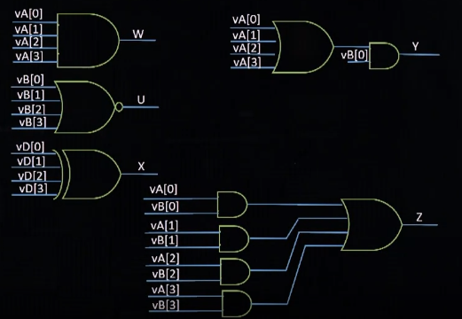
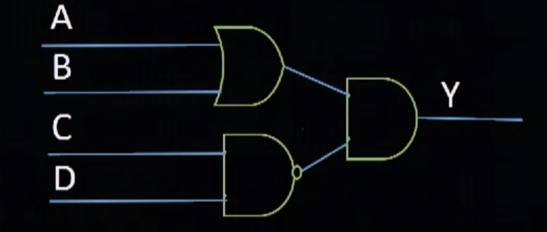
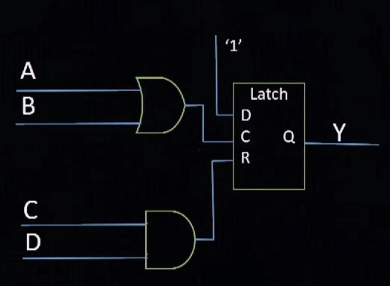

# Combinatorial Circuits

```verilog
module gates (
    input [3:0] VA, VB, VC, VD,
    output W, U, X, Y, Z
    );
    assign W = & VA;    // Vector Reduction AND Gate
    assign U = ~| VB;   // Vector Reduction NOR Gate 
    assign X = ^ VD;    // Vector Redustion XOR Gate
    assign Y = | VA & VB;
    assign Z = | (VA & VB)
endmodule
```



## Procedural Combinatorial Logic with Alway Procedures

```verilog
module always_combo (
    input A, B, C, D,
    output reg Y
    );

    always @(A or B or C or D)
    begin
        if ((C==1) && (D==1))
            Y <= 0;
        else if ((A==1) || (B==1))
            Y <= 1;
        else
            Y <= 0;
    end
endmodule
```



Note que foi gerado um circuito combinancional, o uso do reg não necessariamente irá atribuir um registrador ao circuito. No entanto, se nesse mesmo código não cobrirmos todos os casos, por exemplo, retirando o else do código, criaremos um latch não intencional.

```verilog
module always_combo (
    input A, B, C, D,
    output reg Y
    );

    always @(A or B or C or D)
    begin
        if ((C==1) && (D==1))
            Y <= 0;
        else if ((A==1) || (B==1))
            Y <= 1;
    end
endmodule
```



---
# Synchronous Circuits

## Flip Flop
### Simple D Flip Flop
```verilog
module DFF (
    input D, 
    output reg Q
    );

    always @(posedge CLK)
    begin
        Q <= D;
    end
endmodule
```

### D Latch
```verilog
module DLatch (d, clk, aclr, qldc, qld);
    // Inout Definiton
    input d, clkm aclr;
    output reg qldc, qld;

    always @(clk or d) // no posedge
    begin
        if (clk == 1) qld <= d;
    end

    always @(clk or d or aclr)
    begin
        if (aclr == 1) qldc <= 0;
        else if (clk == 1) qldc <= d;
    end

endmodule
```

### D Flip Flop w/ Reset
```verilog
module DFF (d, clk, clr, reset, qld, qlda, qlds);
    input d, clk, clr, reset;
    output reg qld, qlda, qlds;
    
    always @(posedge clk)
    begin
        qld <= d;
        if(reset == 1) qlds <= 0;
        else qlds <= d; // FF with sync reset
    end

    always @(posedge clk or negedge clr)
    begin
        if (clr == 0) qlda <= 0;
        else qlda <= d; // FF with async reset
    end
endmodule
```

### D Flip Flop w/ Reset and Clock Enable
```verilog
module DFF (d, clk, ce, clr, reset, qlda, qlds);
    input d, clk, ce, clr, reset;
    output reg qlda, qlds;
    
    // FF With sync reset & clk enable
    always @(posedge clk)
    begin
        if(reset == 1) qlds <= 0;
        else if (ce == 1) qlds <= d; 
    end

    // FF with async reset & clk enable
    always @(posedge clk or posedge clr)
    begin
        if (clr == 1) qlda <= 0;
        else if(ce == 1) qlda <= d;
    end
endmodule
```

---
## Counters and Data Register

### Data Register

```verilog
module DReg (
    input wire [3:0] d, 
    input wire clk, reset, load
    output reg [3:0] q
    );

    always @(posedge clk or negedge reset)
    begin
        if(reset) q <= 0;
        else if (load == 1) q <= d;
    end

endmodule
```

### Shift Register

```verilog
module Shifter (clk, reset, d0, shift, q);
    input clk, reset, d0, shift;
    output reg  [3:0] q;

    always @(posedge clk)
    begin
        if (!reset)
            q <= 4'b0000;
        else if (shift = 1)
            begin
                q <= q << 1;
                q[0] <= d0;
            end;
        else ;
    end
endmodule
```

### Binary Counter

```verilog
module counter (
    input wire [3:0] d,
    input wire clk, reset, load, en,
    output reg [3:0] q
    );

    always @(posedge clk)
    begin
        if (reset) // sync reset
            q <= 0;
        else if (load = 1)
            q <= d;
        else if  (en == 1)
            q <= q + 1;
    end
endmodule
```

### Register File (Memory)
```verilog
module regFile #(
    parameter   Dwidth = 8,
                Awidth = 2
    )
    (
        input wire clk, wren,
        input wire [(Dwidth1):0] wdata,
        input wire [(Awidth1):0] waddr, raddr,
        output wire [(Dwidth1):0] rdata
    );

    // Signal Declaration
    reg [Dwidth-1:0] array_reg [2**Awidth-1:0];

    // Logic Declaration
    always @(posedge clk)
    begin
        if (wren)
            array_reg[waddr] <= wdata;
        assign rdata = array_reg[raddr];
    end

endmodule
```

### Dual Port RAM
```verilog
module DRAM #(
    parameter   Dwidth = 8,
                Awidth = 10
    )
    (
        input wire clk,
        input wire we,
        input wire [(Awidth-1):0] w_addr, r_addr,
        input wire [(Dwidth-1):0] d,
        output wire [(Dwidth-1):0] q,
    );

    // Signal Declaration
    reg [Dwidth-1:0] ram [2**Awidth-1:0];
    reg [Dwidth-1:0] data_reg;

    // RAM Initialization from an external file
    initial
        $readmemh("initialRAM.txt", ram)

    // Body
    always @(posedge clk)
        begin
            if(we)
                ram[w_addr] <= d;
            data_reg <= ram[r_addr];
        end

    // Read Operation
    assign q = data_reg;

endmodule
```

### ROM
```verilog
module DRAM #(
    parameter   Dwidth = 8,
                Awidth = 3
    )
    (
        input wire clk,
        input wire [(Awidth-1):0] addr,
        output wire [(Dwidth-1):0] data
    );

    // Signal Declaration
    reg [Dwidth-1:0] rom_data, data_reg;

    // RAM Initialization from an external file
    initial
        $readmemh("initialRAM.txt", ram)

    // Body
    always @(posedge clk)
        data_reg <= rom_data;

    always @*
        case(addr)
            3'b000: rom_data = 8'b1000_0000;
            3'b001: rom_data = 8'b1010_1010;
            3'b010: rom_data = 8'b0101_0101;
            3'b011: rom_data = 8'b1000_0011;
            3'b100: rom_data = 8'b0000_0000;
            3'b101: rom_data = 8'b1001_1001;
            3'b110: rom_data = 8'b1000_0001;
            3'b111: rom_data = 8'b1111_0000;
        endcase

    // Assign output
    assign data = data_reg;

endmodule
```

---
# Bus and Tristate Buffers
## Tri-State bus

Esse codigo é sintetizavel porem não podera ser simulado

```verilog
module Tri (
    input wire [3:0] Dout,
    input wire OE,
    output wire [3:0] Pinout
    );

    assign Pinout = OE ? Dot : 4'bz

endmodule
```

O proximo codigo pode ser usado para simulação, nesse caso esta coberto os casos em que OE é 'desconhecido'

```verilog
module TriSim (
    input wire [3:0] Dout,
    input wire OE,
    output wire [3:0] Pinout
    );

    assign Pinout = (OE == 1) ? Dout:
                    (OE == 0) ? 4'bz : 4'bx;

endmodule
```

## Bi-Directional bus
```verilog
module BiDir (
    input wire [3:0] Din,
    input wire [3:0] Dout,
    input wire OE,
    inout wire [3:0] IOpin
    );

    assign Din = IOpin;
    assign IOpin = (OE == 1) ? Dout:
                   (OE == 0) ? 4'bz : 4'bx;

endmodule
```

## Manipulating Buses
```verilog
module BusMe (
    input wire [3:0] A,
    input wire [3:0] B,
    output wire X,Y,
    output wire [5:0] Dout
    );

    assign Dout = {B,A[2:0]};
    assign X = A[3];
    assign Y = A[4];

endmodule
```

