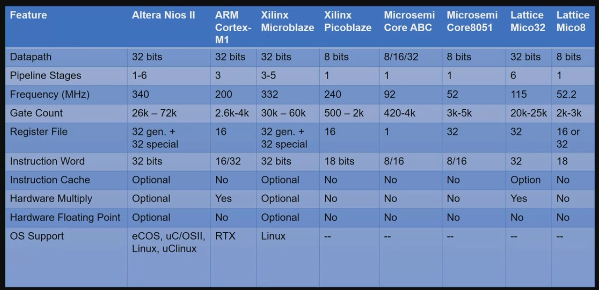
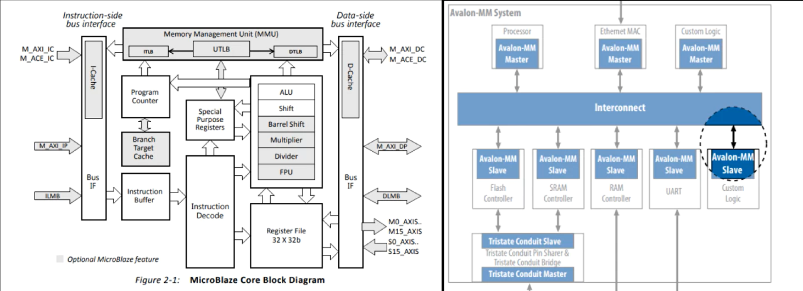
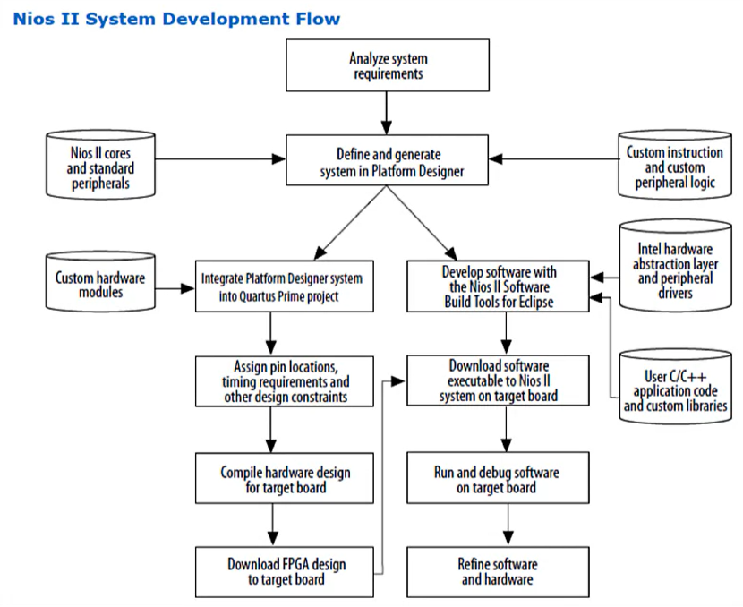
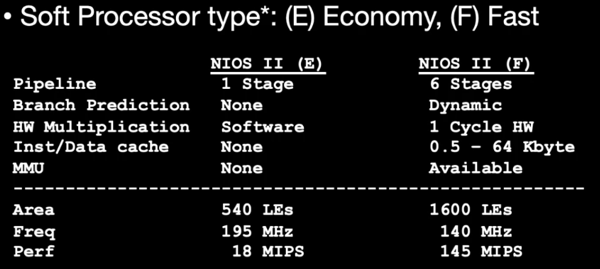
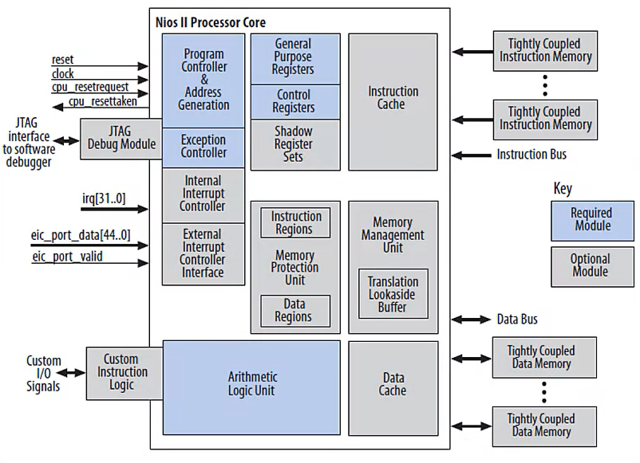

# Soft Processor Review

---
## SoftProcessor Advantages

- Flexibility: Hardware Vs Software
  - Team: C programmers vs HDL Programmers
  - Software tasks: Dedicated FPGA Logic
  - Pre-Compiled before selecting FPGA
  - Memory: cache size selectable

- Infinitely Migratable into Future FPGA devices
  - C Code, processor configuration
  - Increased performance, lower power, lower cost
  - Move into larger or smaller device
  - Add another core for new features

- Dedicated BUS Structure
  - Intel-Altera NIOS: Avalon
  - Xilinx Microblaze: AXI
  - Microsemi ARM Cortex-M1: AHB

---
## Intel/Altera SoftProcessor Flow

---
## NIOS II Types

- (E) Economy
- (F) Fast
  

---
## NIOS II Architecture

- NIOS II Features:
  - 32b RISC
  - Quantity 32 general-purpose-registers
  - Quantity 32 interrupt sources
  - External interrupt controller for more interrupt sources
  - Single-instruction 32x32 multiply and divide producing a 32b result
  - Dedicated instructions for computing 64b and 128b products of multiplication
  - Optional floating-point instructions for single-precision floating-point operations
  - Single-instruction barrel shifter
  - Acces to on-chip peripherals, and interfaces to off-chip memories and peripherals
  - Optional MMU
  - Optional MPU
  - Software dev based on GNU C/C++
  - Integration with FPGAs Signal Tap Analyzer
  - Instruction set compatible across all processor system
  - Performance up to 250 DMIPS
  - Optional ECC support  for a subset of processor internal RAM 
