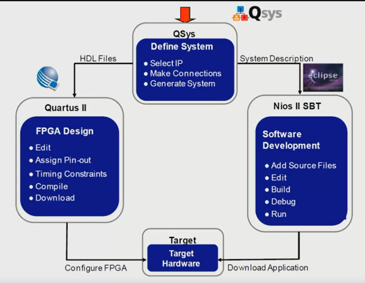
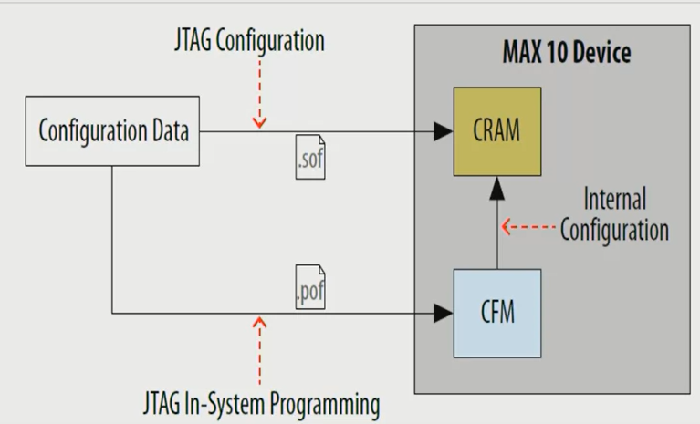

# Software for Processors

- Intel SoC EDS (Embedded Development Suite) for ARM hard-core processors featuring ARM DS5
- Intel EDS (Embedded Design Suite) for NIOS II
- Altera Monitor Program

## NIOS II Software Build Tools (SBT)

- Based in Eclipse
- Developers can create and debug app without further knowledge o FPGAs
- The SBT automates creation of a Board Support Package (BSP) for the C/C++ interactive runtime environment
- GNU compilers are used (GCC)
- SBT creates the project makefiles for code builds
  

---
## MAX10 Programming
