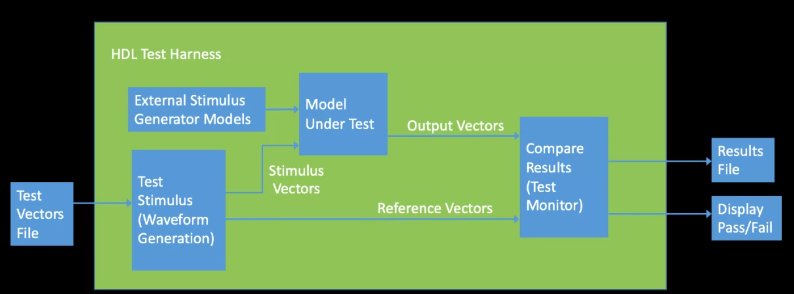

# Modular Design in Verilog

## Component Instantiation

```verilog
module module_name_top (
    port connection list
)
    instance_name_1 (port connection list),
    instance_name_2 (port connection list),
    instance_name_N (port connection list),

endmodule

```

## Loop in Verilog

- repeat
- while
- forever
- for

```verilog
module scalarAnd #(
    parameter N = 4
    )
    (
        input g,
        input [N-1:0] a,
        output [N-1:0] y
    );

    reg [N-1:0] tmp, y;
    integer i;

    always @(a or g)
    begin
        for(i=0; i<N; i=i+1)
            begin
                tmp[i] = a[i] & g;
            end
    end

endmodule

```

## Generate on Verilog

```verilog
module XorGen #(
    parameter   widht = 4
                delay = 10
    )
    (
        input [1:width] xin1, xin2,
        output [1:width] xout
    );

    generate
        genvar i;
        for(i=0; i<=width, i=i+1)
        begin
            assign #delay
                xout[i] = xin1[i] ^ xin2[i];
        end
    endgenerate

endmodule

```

# Testbench in Verilog




```verilog
// Set timesclae to nanoseconds, ps precision
'timescale 1 ns / 1 ps

module Adder_tb(); // No sensitivy list

    reg [3:0] a_tb, b_tb;   // data input stimulus
    reg Cin;                
    wire [3:0] y_tb;        // data output response
    wire Co_tb;
    reg [3:0] expected;     // expected sum result

    // DUT Instantiation
    add4 DUT(.A(a_tb), .B(b_tb), .Cin(Cin),
             .Sum(y_tb), .Cout(Co_tb));

    // Test Stimulus Generation
    initial
        begin
            #0 a_tb=2; b_tb=2; Cin=0; expected=4;
            #10 a_tb=15; b_tb=0; Cin=1; expected=0;
            #10 a_tb=2; b_tb=4; Cin=1; expected=7;
            #10 stop
        end
    
    // Test Results
    initial
        $monitor("time=%d, a=%b, b=%b, Cin=%b, sum=%b, cout=%b, expected sum=%b,
        $time, a_tb, b_tb, Cin, y_tb, Co_tb, expected);
        
endmodule
```